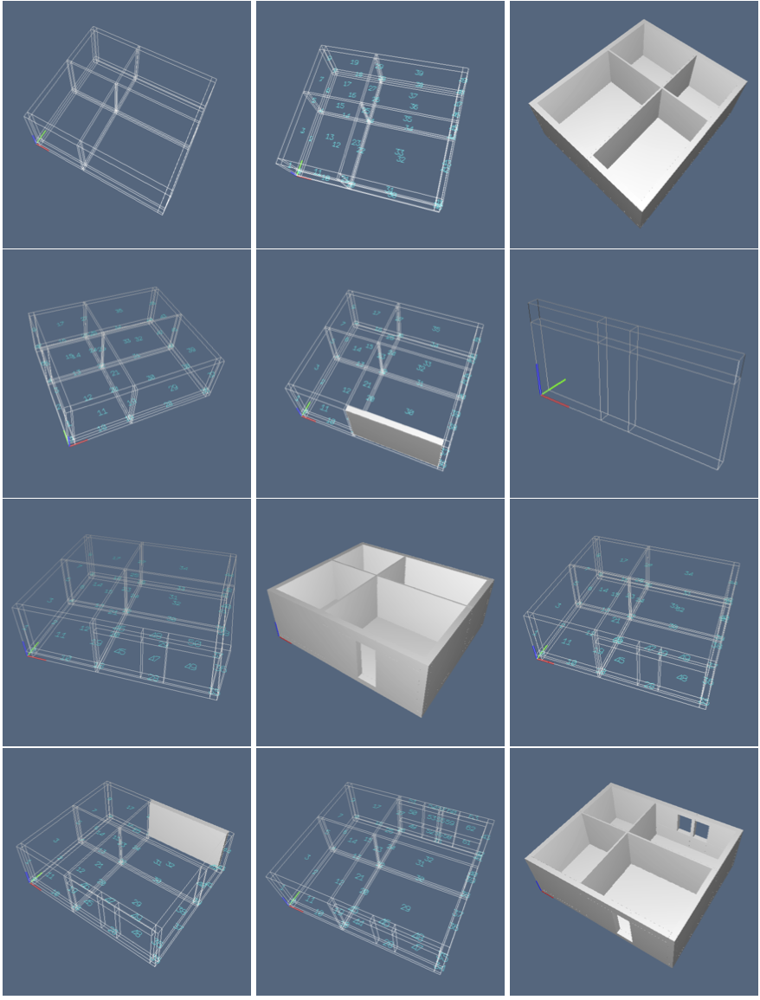

### The DEADLINE is delayed until MAY 25 AT 7PM

- - -

# Homework assignment n.3
**Computational Visual Design Lab ([CVDLab](https://github.com/cvdlab))**  
**"Roma Tre" University, Rome, Italy**  
**Computational Graphics 2014**

## Introduction 

This assignment is a short voyage to *"Blocklandia"*, where both the people and the world are made of 3D blocks :o)

Notice that 90% of modern buildings (in Europe and Far East) are made this way.
In case it is different, make an approximation of your home to this model.

Starting from a single "diagram" (a 3-array of 3D blocks), proceed to detail a 3D model of the place where you live (the apartment of your family, probably), according to the method of mapping a new diagram in a cell of a "master" diagram.

## Notes

You may use either pyplasm operators or LAR objects, mixing-up both, or developing your own primitives.  We suggest using the `sysml.py` module from `lar-cc`. Notice that a fresh update has been just committed (`pull` the new version!).

The programming assignment must be produced in Python language, using the [`Pyplasm`](https://github.com/plasm-language/pyplasm) module for Python and/or the [`LAR`](https://github.com/cvdlab/lar-cc) project.


## Caveat

The homework is **strictly personal**, and must be worked out by a single student.    
Violations will be persecuted :o) 


# Exercises

## Exercise 0  (3/30 points)

Produce a HTML page with 

1.  Your name and surname;
2.  University ID (matricola);

and with

4. short description of the work done; 
5. some interesting images of the work;
6. links to `exercise1.py`, `exercise2.py`, etc. 

## Exercise 1   (9/30 points)

Generate a 3D model of your apartment, detailing one block at a time.

## Exercise 2   (9/30 points)

Make a vertical and horizontal aggregation of several apartments, including a ground floor 
made using perhaps some curved geometry (with bezier or b-spline curves, surfaces or solids).

## Exercise 3   (9/30 points)

Automatize the loop "merging-numbering-elimination" of blocks, shown in `lar-cc/test/py/sysml/text04.py`, providing a software interface where a single 3-array of blocks is mapped at the same time against a number of master's blocks.

## Exercise 4   (GREAT BONUS: saturation to LAUDE!)

Make an efficient version of the `sysml.diagram2cell` function, that currently is pretty space-inefficient, and does not support the topological requirements of the LAR representation [after merging, common vertices are repeated, and new vertices of the mapped diagram are not inserted in the co-boundary cells].



# Assignment delivery

For each exercise you must produce a corresponding file `exercise1.py`, `exercise2.py`, etc.  
All the `.py` file must be enclosed within a directory `python`. The images within a directory `images`. 
Such directories must be contained in a directory entitled `2014-05-16`, pushed into the personal GitHub repository of the student: [https://github.com/cvdlab-cg/xxxxxx](https://github.com/cvdlab-cg/) where `xxxxxx` is the student ID  (matricola). 

```
─── xxxxxx
    └── 2014-05-16
        ├── images
        │   ├── fig01.png
        │   ├── fig02.png
        │   └── etc.
        ├── index.html
        └── python
            ├── exercise1.py
            ├── exercise2.py
            ├── exercise3.py
            └── exercise4.py
```

The delivery is strictly required within 24 hours from the publication of the homework.

# Tips

#### Commit and push as frequently as you can

